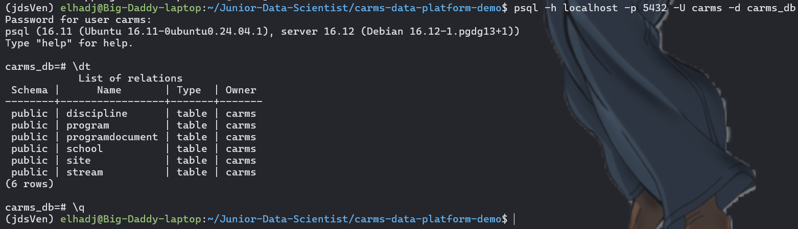
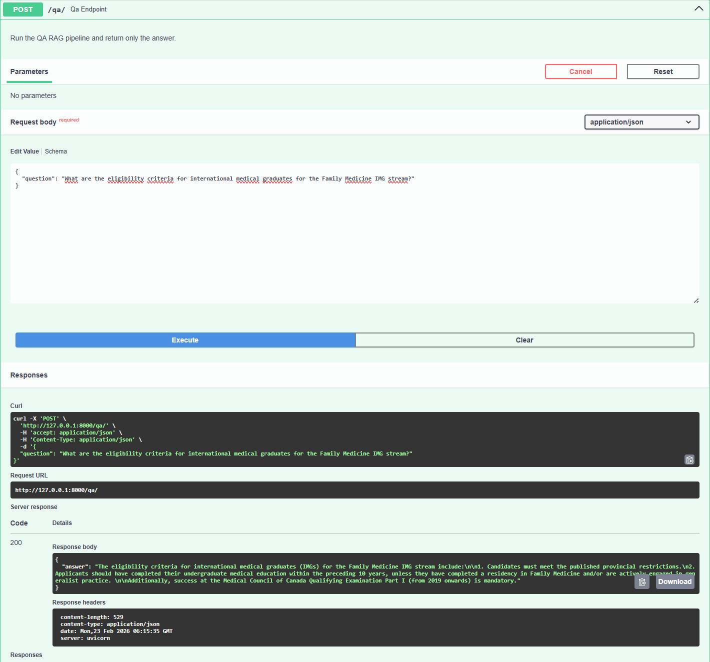
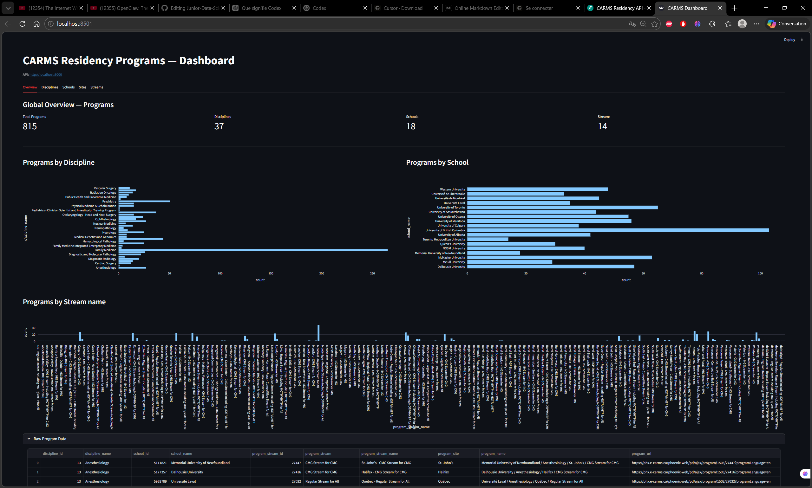
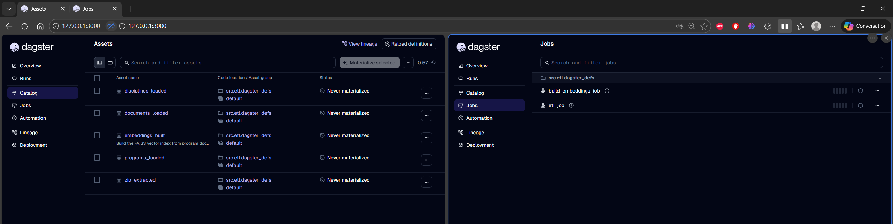

# CARMS Data Platform — End‑to‑End Data Engineering Project

This project is a data platform built around public CaRMS residency program data.  
It includes automated ETL pipelines, a normalized PostgreSQL database (3NF), a FastAPI backend, a multi‑tab Streamlit analytics dashboard, Dockerized infrastructure, Makefile automation, and a LangChain‑powered RAG QA system.  
An AWS‑ready architecture is also provided for production deployment.

**Stack used:** PostgreSQL, SQLModel, Dagster (ETL orchestration), LangChain + OpenAI (RAG QA), FastAPI (REST API), Docker + Docker Compose, Make (one-command setup), Streamlit (visualization). Target AWS architecture is described in [docs/aws-architecture.md](docs/aws-architecture.md).

# 1. Relational Database Design, Normalization & Population

## 1.1 Overview

This project begins by transforming raw CaRMS program data into a fully normalized relational PostgreSQL database.
Two Excel files serve as the foundation for the schema design and population:

- **1503_discipline.xlsx**
- **1503_program_master.xlsx**

The discipline file contains simple key–value pairs, while the program master file contains multiple attributes that must be decomposed to avoid update, insertion, and deletion anomalies.
> “Creating a single table program with that file will not be normalized… thus we will need to break down the file into 4 tables for normalization purpose.”
>

The final schema follows **3rd Normal Form (3NF)** and ensures long‑term maintainability, consistency, and clean referential integrity.

---

## 1.2 Source Files

### **1. 1503_discipline.xlsx**
Contains:
- `discipline_id`
- `discipline_name`

This file maps directly to a normalized table:

**Table: discipline**
| Column          | Type |
|-----------------|------|
| discipline_id   | PK   |
| discipline_name | Text |

> “A table discipline is thus created.”
>

---

### **2. 1503_program_master.xlsx**
This file contains multiple attributes mixed together:

- discipline
- school
- program
- program stream
- site
- program URL

Storing this in a single table would violate normalization rules.
Therefore, the file is decomposed into **four relational tables**.

---

## 1.3 Normalized Schema (3NF)

### **Table: school**
| Column      | Type |
|-------------|------|
| school_id   | PK   |
| school_name | Text |
---
### **Table: site**
| Column    | Type |
|-----------|------|
| site_id   | PK (auto‑increment) |
| site_name | Text |
---
### **Table: stream**
| Column    | Type |
|-----------|------|
| stream_id | PK (auto‑increment) |
| stream    | Text |
---
### **Table: program**
| Column              | Type |
|---------------------|------|
| program_stream_id   | PK   |
| discipline_id       | FK → discipline |
| school_id           | FK → school |
| site_id             | FK → site |
| stream_id           | FK → stream |
| program_name        | Text |
| program_stream_name | Text |
| program_url         | Text (url)|
---

## 1.4 ETL & Database Population

The ETL pipeline loads the Excel files **row by row**, and inserts them into the PostgreSQL database.

Tools used:
- **SQLModel** for ORM models
- **Docker Compose** for PostgreSQL container
- **Manual ETL or Dagster UI** for orchestration

> “ docker‑compose + SQLModel + ETL (manual)/Dagster UI ”
>

These two files are sufficient to build the **core relational PostgreSQL database** storing and maintaining all disciplines and programs.

---

# 2. QA RAG System (Retrieval-Augmented Generation)

## 2.1 Overview

In addition to the relational database, the project includes a **Retrieval‑Augmented Generation (RAG)** pipeline designed to answer questions about CaRMS programs using program descriptions.

The raw program descriptions are provided in 6 ZIP archives containing Markdowns (`.md`), JSONs, and a CSV file.
I only use the CSV format file version of the programs description:

- `1503_program_description_x_section.csv`

Then created a table in the relational database named `program_document` to store the description.


## 2.2 Program Document Table

The CSV file is transformed into a structured table that links each description to its corresponding program stream.

**Table: program_document** (main columns)

| Column               | Type | Notes |
|----------------------|------|-------|
| id                   | PK   | Auto-increment |
| program_stream_id    | FK   | Links to normalized program table |
| section_name         | Text | Section of the description |
| content              | Text | Raw text content |
| source               | Text | URL |

This table becomes the **single source of truth** for all downstream retrieval and QA operations.

Thus, below is the complete normalized relational schema created:



## 2.3 Text Chunking & Embeddings

Long program descriptions are split into smaller, semantically meaningful chunks.
Each chunk is then embedded using an OpenAI embedding model.

Pipeline:

1. **Chunking**
   - Split long text into smaller segments
   - Preserve section metadata

2. **Embedding**
   - Convert each chunk into a dense vector
   - Store vectors in a FAISS index


## 2.4 FAISS Vector Store

The embeddings are stored in a **FAISS vector index**, enabling fast similarity search.

- Efficient retrieval of top‑5 relevant chunks
- Reproducible index build
- Integrated with LangChain retrievers


## 2.5 Retrieval-Augmented Generation Pipeline

The RAG pipeline follows a standard architecture:

1. **User question**
2. **Retriever**
   - FAISS returns the top 5 most relevant chunks
3. **LLM reasoning**
   - model (`gpt-4o-mini`)
4. **Answer generation**


This ensures that all answers are grounded in real CaRMS program descriptions.

---
# 3. FastAPI Backend (Database + QA Endpoints)

## 3.1 Overview

FastAPI serves as the backend layer of the platform, exposing both the **relational database** and the **RAG QA system** through REST endpoints.
This allows external applications, dashboards, or analysts to interact with the relational Postgres database and the QA engine.

The backend is fully modular and integrates:

- SQLModel / SQLAlchemy ORM models
- Postgre db
- FAISS + LangChain RAG pipeline
- Automatic API documentation via `/docs`

---

## 3.2 Architecture

The FastAPI backend is organized into two main modules:

### **1. Database Endpoints**
These endpoints expose normalized relational data:


All responses are returned as JSON objects.


---

### **2. QA Endpoints (RAG System)**
These endpoints allow users to query the RAG pipeline:



This makes the QA system accessible as a simple HTTP API.

---

## 3.3 Relational Database Endpoints (with execution screenshots)

Below are all relational endpoints exposed by the FastAPI backend, each with a placeholder for execution screenshots stored in `docs/imgs/`.

---

###  Disciplines

#### **GET /disciplines/**
List all disciplines.


#### **GET /disciplines/{discipline_id}**
Retrieve a specific discipline.


#### **GET /disciplines/{discipline_id}/programs**
List all programs for a discipline.


---

###  Programs

#### **GET /programs/**
List all programs.


#### **GET /programs/{program_stream_id}**
Retrieve a program by stream ID.


---

###  Schools

#### **GET /schools/**
List all schools.


#### **GET /schools/{school_id}**
Retrieve a specific school.


#### **GET /schools/{school_id}/programs**
List all programs offered by a school.


---

###  Sites

#### **GET /sites/**
List all sites.


#### **GET /sites/{site_id}**
Retrieve a specific site.


#### **GET /sites/{site_id}/programs**
List all programs associated with a site.


---

###  Streams

#### **GET /streams/**
List all program streams.


---

# 4. Installation & Setup

This section describes the full setup: **Make** , **Docker** (full stack), **visualization dashboard**, and **AWS** deployment notes.

---

## 4.1 Quick build

**Prerequisites:** Docker, Python 3.10+, `make`. On Windows use WSL2 and ensure Docker Desktop has WSL2 integration enabled.

```bash
git clone https://github.com/ElhadjDt/Junior-Data-Scientist.git
cd Junior-Data-Scientist/carms-data-platform-demo
cp .env.example .env
# Edit .env: set OPENAI_API_KEY=your_key_here and optionally DATABASE_URL
```

**project build**
```bash
make clean   
make build      # venv + install + DB + ETL + embeddings
make api        # start FastAPI backend
```
API docs: http://localhost:8000/docs

## 4.2 Visualization dashboard (Streamlit)

A **Streamlit** app in `carms-data-platform-demo/dashboard/` calls the FastAPI backend:

**Run the dashboard** (in another terminal with API running)
```bash
cd Junior-Data-Scientist/carms-data-platform-demo
make dashboard    # Streamlit dashboard
```
  Open **http://localhost:8501**. To point at a different API (e.g. deployed URL), set `API_URL` in the environment.
  Network URL: http://172.26.180.226:8501

dashboard    


## 4.3 Optional: Dagster UI

```bash
make dagster
```



## 4.4 To explore all available commands
```bash
make help
```

---

## 4.5 AWS deployment (target architecture)

A **containerized approach on AWS** is described in **[docs/aws-architecture.md](docs/aws-architecture.md)**. It outlines:

- **RDS** (PostgreSQL) for the relational database
- **ECS Fargate** or **App Runner** for the FastAPI + RAG API (image built from the project Dockerfile)
- **S3** for raw data and FAISS index (or EFS for mount)
- **Secrets Manager** for `OPENAI_API_KEY` and DB credentials
- Dagster or Step Functions for ETL/orchestration
